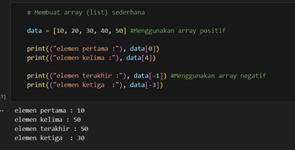
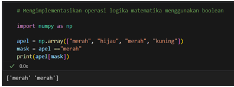
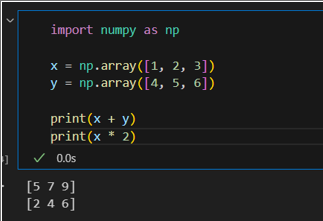

# Kelompok-9
Eksplorasi Materi Mengenai Bahasa Python


## Anggota Kelompok

1. Mokhammad Bahauddin (103102400080) 1 - 3 
2. Gracella Mangalik   (103102400011) 4 - 6  
3. Luluk Nabilah Putri (103102400057) 7 - 9
4. Atika Caya Maylinda (103102400027) 10 - 12 


## 1. Mengenali karakteristik data
Karakteristik data adalah sifat dari data yang disimpan, seperti bentuk, ukuran, tipe, serta bagaimana data tersebut dapat diolah. Misalnya, data bisa berupa angka (integer, float), teks (string), atau logika (boolean).  

    ```python
    # Mengenali karakteristik data
    angka = 25
    teks = "Belajar Python"
    desimal = 3.14
    logika = True
    
    print("angka:", angka, "->", type(angka))
    print("teks:", teks, "->", type(teks))
    print("desimal:", desimal, "->", type(desimal))
    print("logika:", logika, "->", type(logika))
    
Output: 

angka: 25 -> <class 'int'>]

teks: Belajar Python -> <class 'str'>

desimal: 3.14 -> <class 'float'>

logika: True -> <class 'bool'>

Keterangan :

 •	int → bilangan bulat

 •	str → teks

 •	float → bilangan pecahan

 •	bool → nilai logika True/False

## 2. Tipe Data

Tipe data adalah jenis nilai yang bisa disimpan dan diproses dalam program. Python memiliki berbagai tipe data dasar seperti integer, float, string, boolean, list, tuple, dan dictionary.

 
    ```python
    # Contoh tipe data
    a = 10          # integer
    b = 2.5         # float
    c = "Python"    # string
    d = [1, 2, 3]   # list
    e = (4, 5, 6)   # tuple
    f = {"x": 7}    # dictionary
    
    print("a:", a, "->", type(a))
    print("b:", b, "->", type(b))
    print("c:", c, "->", type(c))
    print("d:", d, "->", type(d))
    print("e:", e, "->", type(e))
    print("f:", f, "->", type(f))

Output: 

a: 10 -> <class 'int'>

b: 2.5 -> <class 'float'>

c: Python -> <class 'str'>

d: [1, 2, 3] -> <class 'list'>

e: (4, 5, 6) -> <class 'tuple'>

f: {'x': 7} -> <class 'dict'>

Keterangan :

 • int → bilangan bulat

 • float → bilangan pecahan

 • str → teks

 • list → data terurut, bisa diubah

 • tuple → data terurut, tidak bisa diubah

 • dict → pasangan kunci-nilai


## 3. Membuat array dengan berbagai teknik

Array adalah struktur data untuk menyimpan sekumpulan nilai. Di Python, array bisa dibuat dengan list biasa atau dengan library array/numpy.

    ```python

    # Membuat array dengan list
    arr1 = [10, 20, 30, 40]
    
    # Membuat array dengan module array
    import array
    arr2 = array.array('i', [1, 2, 3, 4])
    
    # Membuat array dengan numpy
    import numpy as np
    arr3 = np.array([100, 200, 300])
    
    print("Array list   :", arr1)
    print("Array module :", arr2)
    print("Array numpy  :", arr3)
    
Output:

Array list   : [10, 20, 30, 40]

Array module : array('i', [1, 2, 3, 4])

Array numpy  : [100 200 300]

Keterangan :

 • list → cara termudah membuat array di Python

 • array (dari module array) → lebih hemat memori, hanya untuk tipe data homogen

 • numpy.array → mendukung operasi matematika lebih kompleks

## 4. Membuat matriks

Matriks adalah susunan bilangan dalam baris dan kolom yang berbentuk persegi panjang. Dalam NumPy, matriks direpresentasikan dengan array dua dimensi. Kita dapat membuat matriks menggunakan fungsi np.array() dengan memberikan data dalam bentuk list bersarang (nested list).

Contoh: 

Keterangan:

 •  Matriks A dibuat dengan 2 baris dan 3 kolom.
 
 •  np.array() mengubah list Python menjadi array NumPy.
 
 •  Hasilnya adalah representasi matriks standar.


## 5. memanipulasi matriks dan operasi-operasi

Manipulasi matriks artinya mengubah bentuk atau orientasi matriks. Contohnya transpose (menukar baris jadi kolom), reshape (mengubah ukuran), atau indexing/slicing (mengambil elemen tertentu). Operasi-operasi matriks mencakup penjumlahan, perkalian elemen, dan perkalian matriks (dot product). NumPy menyediakan fungsi bawaan yang membuat operasi ini lebih cepat dibandingkan perhitungan manual.

Contoh Memanipulasi Matriks:


Keterangan:

•  Transpose (A.T) menukar baris menjadi kolom.

•  Reshape (A.reshape(3,2)) mengubah bentuk matriks 2x3 menjadi 3x2, tapi nilai elemen tetap sama hanya beda susunan.


Contoh Operasi-operasi Matriks:

Keterangan:
•  A + B → penjumlahan elemen sesuai posisi baris & kolom.

•  A * B → perkalian elemen satu per satu (bukan matriks).

•  np.dot(A, B) → perkalian matriks (sesuai aturan aljabar linier).


## 6. Membuat array multidimensi

Array multidimensi adalah array dengan lebih dari dua dimensi. Contohnya array 3 dimensi (3D) yang bisa dianggap sebagai kumpulan beberapa matriks. Array multidimensi banyak dipakai dalam data citra (gambar), data spasial, dan deep learning.

Contoh:


Keterangan:

•  np.arange(24) membuat angka dari 0 sampai 23.

•  reshape(2,3,4) mengatur bentuknya menjadi 2 blok, tiap blok 3 baris × 4 kolom.

•  arr.shape menunjukkan ukuran array, yaitu (2, 3, 4)


## 7. Mengetahui index elemen pada array

Indeks elemen pada array adalah nomor urut yang digunakan untuk mengakses data di dalam array, biasanya jika angka positif dimulai dari indeks 0  dari baris depan, tetapi jika angka negatif dimulai dari indeks -1 dari baris belakang.

Contoh :




Keterangan : 

  •	Data[i] artinya ambil elemen di posisi ke-i
  
  Contoh : data[0] artinya memanggil elemen yang diposisi indeks ke 0 yaitu 10
  
  •	Jika i billangan positif maka kita lihat urutannya dari depan ke belakang, sedangkan i negatif maka kita lihat urutannya dari belakang ke depan tetapi di mulai dari indeks -1 bukan 0. Sehingga dari contohnya indeks -1 yaitu 50.

## 8. Mengimplementasikan operasi logika matematika menggunakan boolean

Mengimplementasikan operasi logika matematika menggunakan boolean berarti menerapkan operator logika seperti AND (&), OR (|), NOT (~), dan XOR (^) pada array atau variabel boolean untuk menghasilkan array baru yang berisi nilai True atau False sesuai kondisi.

Contoh : 




Keterangan : 

Misal punya keranjang berisi 10 apel, ada yang merah, ada hijau, dan ada yang kuning.

Jika pelanggan bilang: “Saya hanya mau ambil apel yang warnanya merah.”

  •	Keranjang apel = array data (misalnya [merah, hijau, merah, kuning, ...])
  
  •	Kondisi (merah saja) = operasi logika (misalnya apel == "merah")
  
  •	Mask = daftar True/False hasil cek kondisi tiap apel
  
  Contoh: [True, False, True, False, ...]
  
  •	Hasil = apel yang lolos kondisi (semua yang True)

## 9. Melakukan operasi arimatika

Operasi aritmatika pada array adalah perhitungan matematika (seperti tambah, kurang, kali, bagi) yang langsung diterapkan ke semua isi array, tanpa harus menghitung satu per satu dengan perulangan.

Contoh :




 
Keterangan : 

  •	x + y = operasi antar-array (elemen dijumlahkan satu per satu).
  
  •	x * 2 = operasi dengan skalar (semua elemen dikali angka yang sama).


## 10. Elementwise function

Elementwise function adalah proses penerapan operasi atau fungsi matematika pada setiap elemen array secara individual. Artinya, setiao elemen yang berada pada posisi yang sama di dalam dua array (atau satu array tunggal untuk fungsi tertentu) akan dikenai perhitungan yang sama secara serentak tanpa perlu melakukan perulangan manual. Contoh operasi yang termasuk dalam elementwise function antara lain penjumlahan, pengurangan, perkalian, pembagian, maupun fungsi matematika seperti akar kuadrat (sqrt), sinus, atau kosinus. Penggunaan metode ini sangat efisien karena memanfaatkan kemampuan komputasi vector pada library NumPy sehingga pemrosesan data menjadi lebih cepat.


Contoh:


Keterangan:

• a + b → melakukan penjumlahan pada setiap elemen yang posisinya sama di dalam array a dan b.

• np.sqrt(a) → menghitung akar kuadrat setiap element array a tanpa perlu perulangan manual.

• Operasi seperti ini disebut elementwise karena proses dilakukan untuk tiap elemen secara otomatis.

## 11. Melakukan agregasi beberapa array

Agregasi merupakan proses penggabungan dan peringkasan data untuk memperoleh informasi ringkas dari satu atau lebih array. Tujuannya Adalah mendapatkan nilai representatif seperti jumlah total, rata-rata, nilai maksimum, nilai minimum, atau ukuran statistik lain. Sebelum melakukan perhitungan, beberapa array dapat digabungkan menjadi satu kesatuan agar analisis dapat mencakup seluruh data. Teknik agregasi ini umum digunakan dalam analisis data, misalnya untuk menghitung total penjualan, rata-rata nilai ujian, atau rangkuman data eksperimen.


Contoh:


Keterangan:

• np.concatenate([x, y]) → menggabungkan dua array menjadi satu array panjang.

• np.sum(gabung) → menghitung jumlah semua elemen.

• np.mean(gabung) → menghitung nilai rata-rata seluruh elemen.

• np.max() dan np.min() → mencari nilai terbesar dan terkecil dalam array gabungan.

## 12. Melakukan operasi dengan logika himpunan


Operasi logika himpunan Adalah metode untuk menganalisis hubungan antar dua set data yang direpresentasikan dalam bentuk array. Operasi ini memungkinkan pengguna untuk menentukan gabungan (union), irisan (intersection), maupun selisih (difference) dari dua
array. Dengan memanfaatkan fungsi bawaan NumPy, proses identifikasi elemen yang sama, elemen unik, maupun elemen yang hanya terdapat pada salah satu array dapat dilakukan secara efisien. Pendekatan ini sangat berguna ketika diperlukan analisis kesamaan atau perbedaan data, misalnya dalam pengelolaan basis data atau perbandingan hasil pengukuran.


Contoh:


Keterangan:


• np.union1d(data1, data2) → menghasilkan gabungan kedua array tanpa duplikasi.

• np.intersect1d(data1, data2) → menampilkan elemen yang terdapat pada kedua array (irisan).

• np.setdiff1d(data1, data2) → menampilkan elemen yang hanya ada pada data1 tetapi tidak terdapat pada data2.

## 13. Memanipulasi array (Dikerjakan Bersama)
Manipulasi array adalah proses mengubah array sesuai kebutuhan, misalnya menyalin, merubah bentuk (reshape), menggabungkan, memisahkan, atau mengurutkan elemen-elemen di dalam array.


